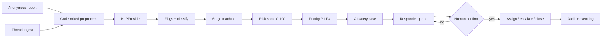

# SurakshaNet

A multilingual Indian child-safety reporting and responder desk.
Protective and detective only. **The model never decides an intervention.**
Every irreversible step (escalate, unseal identity, close, purge) needs a human confirm.

## What you can do

- **Share something** — anonymous, no account. English / Hindi / Marathi / Tamil, including Hinglish and Tamil-English mix. Leave in one tap. Childline **1098** sits on every child screen.
- **See how detection works** — labeled synthetic examples only (low / medium / high / critical).
- **Sign in as a responder** — priority queue, explainable scores, assignment, audit, analytics.

## How a case moves

ingestion → code-mixed preprocess → classify + flags → stage machine
(`contact → trust-building → isolation → exploitation attempt`) →
risk 0–100 → P1–P4 + SLA → AI safety pack (labeled) → human action → resolution.

## Privacy posture

- Anonymous tips store no IP, email, or device id.
- Text is redacted before storage; originals are hashed.
- Callback numbers live in a separate AES-256-GCM vault (simulated KMS), sealed by default.
- Access is logged without copying message bodies.
- DPDP Act 2023 and POCSO notes live on the Privacy page. Export packs are **SIMULATED**, not filings.

## Tests

Unit tests cover language detection, false-positive guards (surprise party, homework),
the labeled synthetic set, scoring, and one end-to-end lifecycle including the
human-confirm gate on authority escalation.

## Split topology

`docker-compose.yml` documents Postgres + Redis + the Python `nlp-service/`
that implements the same `NLPProvider` contract. The running app uses the
TypeScript hybrid so the desk works without extra processes.
